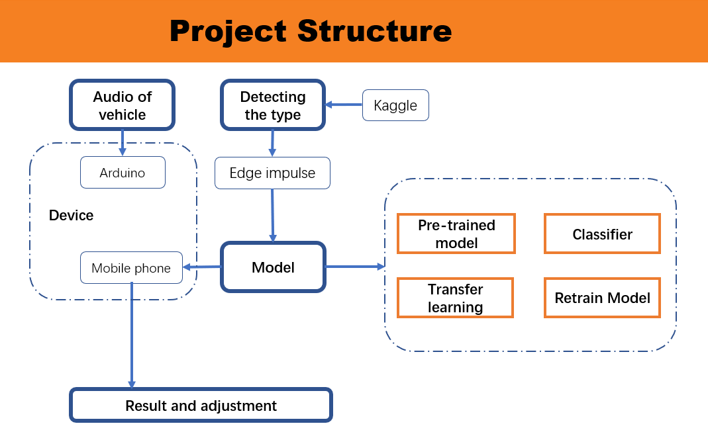
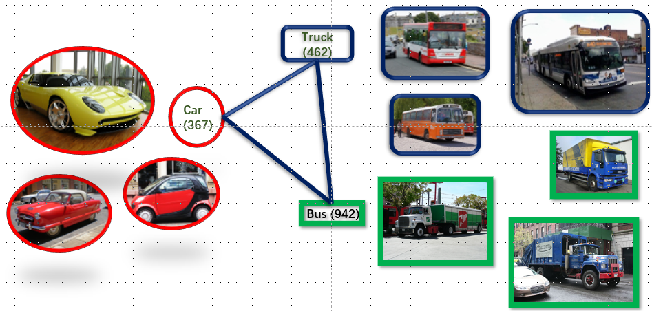
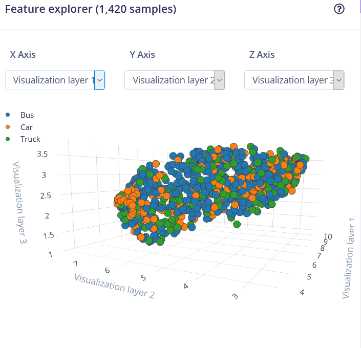
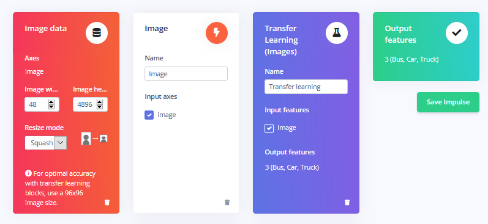
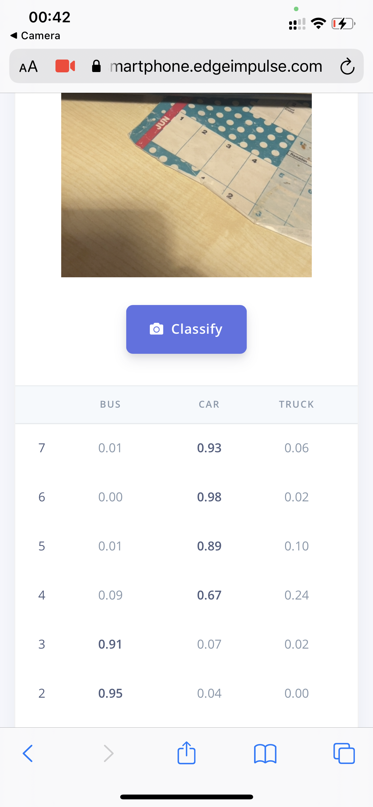

# Report title goes here

Yang Yifan, https://github.com/Yang-Yifan921/Assessment0018 / https://studio.edgeimpulse.com/public/30207/latest

## Introduction

Urban transport is keeping developing and sensor technology can help us build a more convienent and lovable society. I want using deep learning to recognize the car is coming and their shape. So there are two parts. The first goal is to remind people disable and little animals  that there is a vehicle coming with light  flicker. And second part is detect the type of vehicle, which can help city management.

Where it will be used? It can be applied in the parking lot and undeveloped area.

The original of the come from my undergraduate dissertation, which is about detect the distribution of car-sharing(also new energy-driving ) in temporal-sptatial. I found that there are lock of a efficient way to calculate the type and the number of car in the parking. What’s more, because it is two-seat type so the the parking space is not used effectively in a normal scale position. So I think if we can use such tiny sensor to collect data, maybe it can not only effectively improve the traffic efficiency, but also help to analyze the urban land use problem. 

## Research Question

Recognition the type of vehicle and alert the surrounding and recorder

## Application Overview

This project aims at using tiny device to detect the vehicle and recognize their types. The devices involved are Arduino and mobile phone. 

At the beginning, we expect the sound of car will wake up the Arduino and the light begins flicker to remind people here is car coming. Then we use mobile phone as main device to run the experiment. We input data from Kaggle to Edge Impulse, then labeled data was divided into Training data and Test data. After the platform acquire the data, creating impulse and setting the parameter will lead to a visible result. During this step, image data are set in size, grayscale, chosen the proper neuron. 

Next, in transfer learning model, learning rata and training cycles are adjusted under circumstance. Besides, regarding as the accuracy is not good, another model are tried and contrasted with transfer learning model. At the end, we adjust them and using mobile phone’s camera to detect object and receive satisfied result.

## Data

The image is about types of vehicle. The data source is kaggle: The images are divided into Car, Bus and Truck, and those are also their labels. 

During the experiment, the accuracy is not satisfied is a obvious problem. So, I recollected the data. More than download from Kaggle, I also search for high-definition car pictures with typical features. Because of the high complexity of the color and elements of the image, I filter out the samples with wrong labels one by one for each type of data.

In the process of data cleaning, it is found that the original sample contains a variety of car shapes, which may be because the samples are also collected through deep learning, so there are some errors. In the data processing, as human brain recognition, it will be difficult to distinguish the specific types, too (even if there are only three kinds), such as two-tier bus and large vans, car and truck which only showing head. Through comparison and summary, it is considered that the following factors interfere with model learning: the diversity of vehicle shape and type; Complexity of road and surrounding conditions and low image quality of light and object.

## Model

The model I using is transfer learning model, which can fine tune a pre-trained image classification model on your data. Good performance even with relatively small image datasets. At the first, the data are divided into 3 types, and their labels is Bus, Car and Truck. Then split them in Training data and Test data. The number of training data is 1403 and Test data is 375. Next, the data input in Edge Impulse are change with size. Image witdth and height is 48*48, and resize mode is squash. Then set flatten layer. The transfer learning would input flatten and output features of 3(Bus, Car, Truck). At the first time, the number of training cycles is 20, and learning rata is 0.0005. Minimum confidence rating is 0.60. Because of the low accuracy, I adjust the epoch and neuron. For contrasting the result, I used simpler classifier to model the data.

## Experiments

After model the 1778 data, we got the result that the accuracy is 60%(actually is lower than the data before I eliminate the illegible photos), and the loss is 0.80. For improvement the model accuracy, we analyze the confusion matrix and found that Bus and Car Truck is easy to be recognized but the Truck has a bad result. The Truck is easy to be thought as Bus. Then I adjust the number of training cycles to 50, the learning rate to 0.0001. Then retrain the model for live classification. Connecting the Edge Impulse, I use my mobile phone to detect the type of vehicles, it can recognize the car and bus and have a relatively high accuracy, but bad performance on Truck. There are the step to deployment for model integration and use in Arduino. 

## Results and Observations

The project aims at using deep learning model to recognize the type of vehicle on the mobile phone. The data come from Kaggle are in three labels and training in transfer learning models. After pretrain model, simple classifier, transfer training and retrain the model, our model can recognize the car and bus, but not good at truck. The parameter are changed for making a better result, but there are some reason that influence device to detect the objective. Complexity of road and surrounding conditions and low image quality of light and object.
So there are improvement needed in truck label. What’s more, to complete the project into a mature application, the wake word at the beginning will be replace with sound of car. 

 { width=50% height=50% }
 { width=50% height=50% }

## Bibliography

1. Huttunen, H., Yancheshmeh, F. S., & Chen, K. (2016, June). Car type recognition with deep neural networks. In 2016 IEEE intelligent vehicles symposium (IV) (pp. 1115-1120). IEEE.. https://ieeexplore.ieee.org/abstract/document/7535529/

2. Luo, X., Shen, R., Hu, J., Deng, J., Hu, L., & Guan, Q. (2017). A deep convolution neural network model for vehicle recognition and face recognition. Procedia Computer Science, 107, 715-720.https://www.sciencedirect.com/science/article/pii/S1877050917304283

----

## Declaration of Authorship

I, Yang Yifan, confirm that the work presented in this assessment is my own. Where information has been derived from other sources, I confirm that this has been indicated in the work.

*Yang Yifan*

29th, April, 2021 
